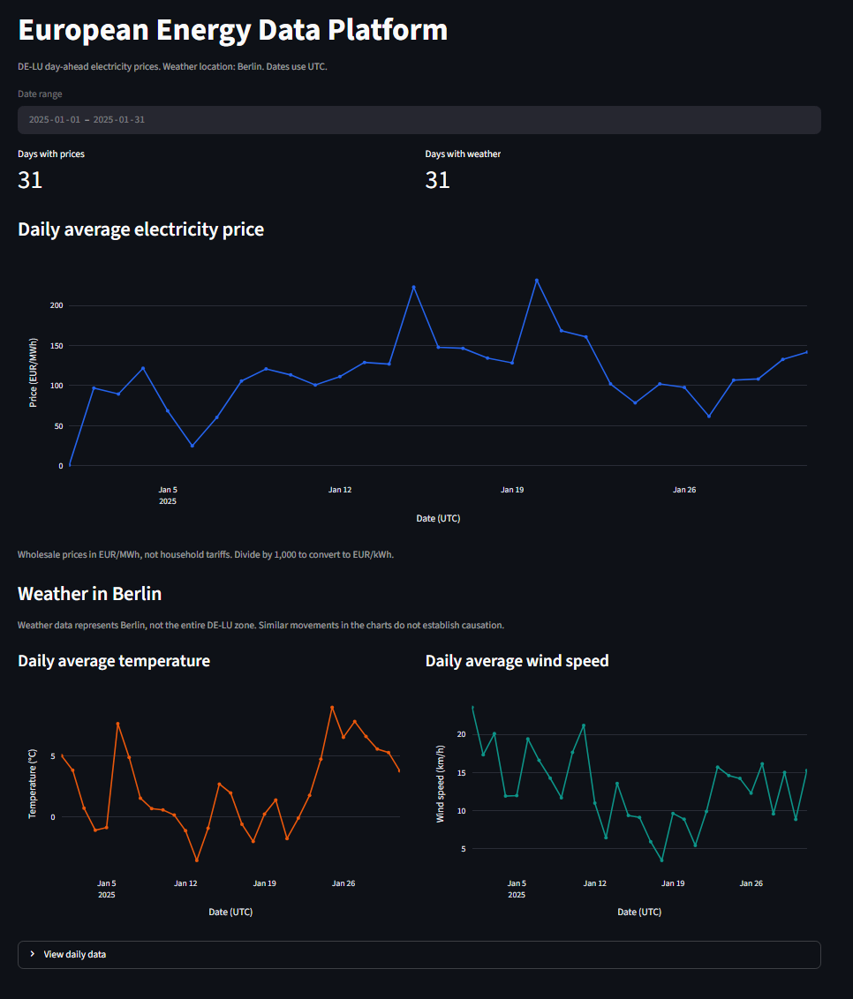
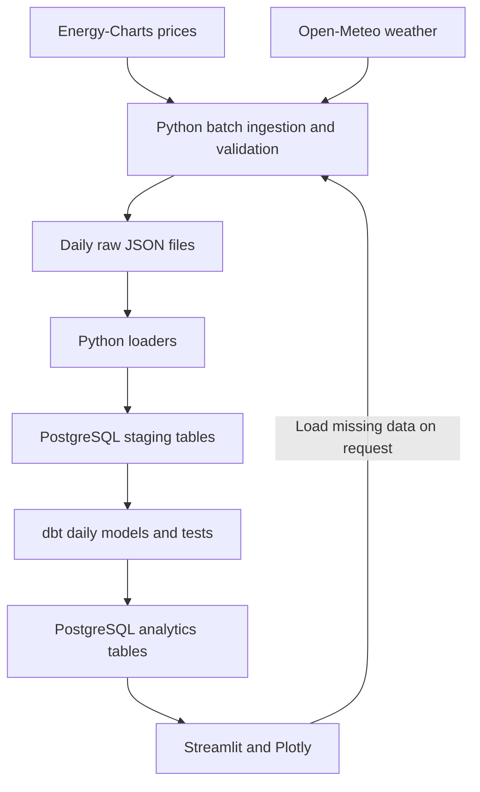

# European Energy Data Platform

[](https://github.com/AlexIorga11/european-energy-data-platform/actions/workflows/ci.yml)

A local data engineering project for exploring day-ahead electricity prices alongside weather in European capitals. Python downloads and validates API data, PostgreSQL stores interval records, dbt builds daily analytics, and Streamlit provides an interactive dashboard.

The project demonstrates batch ingestion, reusable raw files, idempotent database loads, SQL transformations, data-quality checks, and automated tests. It runs locally with Python and a PostgreSQL Docker container.

## What the application does

Choose a capital and an inclusive date range, then select **Load data**. The dashboard checks the daily analytics tables first. If the requested data is complete, it displays the stored results without downloading again. Otherwise, it starts a background Python process to download, validate, load, and rebuild the analytics.

The dashboard includes:

- A capital selector that identifies price coverage before loading.
- Summary cards for available daily price, temperature, and wind values.
- A price chart above two weather charts for capitals with a configured price source.
- A weather-only view for capitals without a configured price source.
- Overview, Daily data, and Source coverage tabs.
- Visible gaps for missing dates, run logs, and warnings for incomplete loads.

### Coverage

`locations.py` defines 51 capitals: 30 have a configured electricity price zone and 21 have weather-only coverage. The 30 mapped capitals share 29 distinct zones. A configured zone does not guarantee source data for every date.

| Capital | Electricity zone | Application coverage |
|---|---|---|
| Berlin | `DE-LU` | Prices and weather |
| Luxembourg | `DE-LU` | Prices and weather |
| Bucharest | `RO` | Prices and weather |
| Paris | `FR` | Prices and weather |
| Baku | Not configured | Weather only |

Electricity prices belong to bidding zones; weather belongs to a location. Berlin and Luxembourg share electricity prices but have different weather records. Weather-only coverage means that this project has no configured price provider for that capital, not that electricity is free or that no provider could ever be added.

Prices are wholesale day-ahead prices in EUR/MWh, not household tariffs. Divide by 1,000 to convert to EUR/kWh. Local weather is not representative of an entire bidding zone, and similar movements in charts do not establish causation.

### Example data view



This Berlin screenshot shows an earlier dashboard layout. The current version adds capital selection, summary cards, and source-coverage tabs. Price data: Energy-Charts, Bundesnetzagentur / SMARD.de. Weather: Open-Meteo. The displayed daily values are aggregates of source data.

## Architecture



| Component | Role |
|---|---|
| Python 3.13 | API access, validation, loading, and pipeline execution |
| PostgreSQL 17 | Persistent interval data and daily analytics |
| Docker Compose | Local PostgreSQL service with a named volume |
| dbt-postgres 1.11.0 | SQL transformations, data tests, and an aggregation unit test |
| Streamlit and Plotly | Interactive dashboard |
| unittest and Streamlit AppTest | Validation, database integration, and dashboard regression tests |
| GitHub Actions | Automated validation of the repository |

Python and Streamlit run on the host. Docker Compose runs PostgreSQL. This version does not use Airflow, cloud storage, or a cloud warehouse.

## Local setup

These commands target Windows PowerShell. Run them from the repository root unless stated otherwise.

### 1. Prerequisites

Install Python 3.13, Git, and Docker Desktop with Linux containers enabled. Start Docker Desktop. Port `5432` must be available for PostgreSQL.

### 2. Clone and install dependencies

```powershell
git clone https://github.com/AlexIorga11/european-energy-data-platform.git
cd european-energy-data-platform
python -m venv .venv
.\.venv\Scripts\Activate.ps1
python -m pip install -r requirements.txt
```

If PowerShell blocks activation, use `.\.venv\Scripts\python.exe` in place of `python` in the remaining commands. Activation is a convenience; installing and running with the same interpreter is what matters.

### 3. Configure a local password

```powershell
Copy-Item .env.example .env
```

Edit `.env` and replace the placeholder with a local password:

```dotenv
POSTGRES_PASSWORD=replace_with_your_local_password
```

Docker Compose, Python, and dbt read this setting. `.env`, downloaded data, and logs are excluded from Git. The configured database is `energy_warehouse`, with user `energy` at `127.0.0.1:5432`.

PostgreSQL uses this password when initializing an empty volume. Changing `.env` later does not change the password inside an existing database.

### 4. Start PostgreSQL and create tables

```powershell
docker compose up -d --wait
docker compose ps
docker compose cp ./sql/create_tables.sql postgres:/tmp/create_tables.sql
docker compose exec postgres psql -U energy -d energy_warehouse -v ON_ERROR_STOP=1 --single-transaction -f /tmp/create_tables.sql
python run_dbt.py debug
python run_dbt.py build
```

The SQL file creates the staging schema and tables. The first dbt build creates the analytics tables even before historical data is loaded. Successful tests on empty tables do not prove data availability.

### 5. Start the dashboard

```powershell
python -m streamlit run dashboard.py --server.address 127.0.0.1
```

Open the local URL printed in the terminal. Keep that terminal and PostgreSQL running. Opening the page does not itself download historical data; pressing **Load data** can start a pipeline.

For a first run, select **Berlin**, from **2025-02-01** through **2025-02-07**. The dashboard should show seven days of prices and weather after a successful load. Search the same period again to verify that stored data is reused.

The selector limits dates to at least seven days behind the current UTC date. This is an application buffer for historical weather, not a guarantee of source availability.

## Command-line loading

A seven-day Berlin example:

```powershell
python pipeline.py --start 2025-02-01 --end 2025-02-07 --locations berlin --batch-days 7
```

This period uses hourly prices: a complete load has 168 price records and 168 weather records. Daily results have seven rows for `DE-LU` and seven rows for Berlin. The combined mart can have additional rows for other configured cities in the same zone.

Load several capitals in one run:

```powershell
python pipeline.py --start 2026-01-01 --end 2026-01-07 --locations berlin paris bucharest --batch-days 7
```

Weather is processed per city; each distinct price zone is processed once per batch. Dates are inclusive. Batch size defaults to seven days and can be set from 1 to 30. API rate limits still apply.

A weather-only example:

```powershell
python weather_pipeline.py --start 2025-02-01 --end 2025-02-07 --location baku --batch-days 7
```

Force a new download when checking upstream corrections:

```powershell
python pipeline.py --start 2025-02-01 --end 2025-02-07 --locations berlin --refresh
```

Refresh overwrites the raw files for that period. Prior versions are not retained.

### Storage and repeatability

Validated daily files are stored at:

- `data/raw/energy_charts/zone=<zone>/YYYY-MM-DD.json`
- `data/raw/open_meteo/location=<location_id>/YYYY-MM-DD.json`

The batch downloaders group consecutive missing or invalid days. They split each response into UTC days and validate all days in the response before saving them. Valid cached files are reused.

Both loaders use upserts. A new key inserts a row; changed values update it; identical values leave it unchanged. Loads commit per day and dataset. A failed later step does not undo earlier committed loads. Rerunning can reuse their raw files and load those days again without creating duplicate keys.

Every successful pipeline execution runs `dbt build`. Analytics tables are fully rebuilt; these are not incremental dbt models. The dashboard's stored-data shortcut skips the entire pipeline when its completeness checks pass.

### Interval rules

`price_rules.py` chooses the expected price interval from the zone and date range. The validator supports 15-, 30-, and 60-minute prices; weather requires 24 hourly records per UTC day. An explicit `--interval-minutes` override changes validation expectations, not the source data or sampling frequency.

The current rules reject periods containing the mixed-resolution UTC day of 30 September 2025 for transitioning zones. Select a period ending by 29 September or starting on 1 October. The configured Swiss hourly rule also rejects dates from 2 November 2026 pending a reviewed transition update. These boundaries describe this implementation, not universal market rules.

`run_daily_pipeline.py` is an optional recent-window launcher that starts Docker Compose and records a log. It does not install a scheduler. It still defaults to a 15-minute override and offers only 15 or 60 minutes; prefer `pipeline.py` for automatic rules and mixed-zone requests.

## Data model

| Relation | Grain or purpose |
|---|---|
| `staging.energy_prices` | One bidding zone and price interval |
| `staging.weather_hourly` | One location and weather hour |
| `analytics.dim_weather_location` | One configured capital with an electricity zone |
| `analytics.mart_energy_daily` | One bidding zone and UTC date |
| `analytics.mart_weather_daily` | One location and UTC date |
| `analytics.mart_energy_weather_daily` | One mapped capital, bidding zone, and energy date |

Staging keys are `(zone, interval_start)` for prices and `(location, interval_start)` for weather. Rows retain a source-file path and load timestamp.

The combined mart joins daily energy to mapped capitals, then left joins weather. Energy days are retained for mapped capitals when weather is missing. Capitals without a zone are excluded from this mart. To display weather-only dates and capitals, the dashboard reads the two daily marts directly with a full outer join filtered by location, zone, and date range.

Price averages are arithmetic means of interval prices, not consumption-weighted averages. Dashboard summary cards average the available daily averages. Missing values stay null; they are never filled with zero.

Example inspection after loading Berlin:

```powershell
docker compose exec postgres psql -U energy -d energy_warehouse -c "SELECT date_utc, avg_price_eur_per_mwh, avg_temperature_c, has_weather_data FROM analytics.mart_energy_weather_daily WHERE weather_location = 'berlin' AND date_utc BETWEEN '2025-02-01' AND '2025-02-07' ORDER BY date_utc;"
```

## Tests and CI

Run the API-independent suites from the repository root:

```powershell
python -m unittest discover -s tests -v
python -m unittest discover -s dashboard_tests -v
```

The repository contains 22 validation tests and 10 dashboard tests. They check invalid units and values, missing or duplicate timestamps, city/date persistence, stored-data reuse, weather-only routing, incomplete loads, chart gaps, and database retry behavior. Dashboard tests simulate data and background processes; they do not establish that an external API is available.

For the four PostgreSQL integration tests, create the separate test database once:

```powershell
docker compose exec postgres psql -U energy -d postgres -v ON_ERROR_STOP=1 -c "CREATE DATABASE energy_warehouse_test;"
docker compose cp ./sql/create_tables.sql postgres:/tmp/create_tables.sql
docker compose exec postgres psql -U energy -d energy_warehouse_test -v ON_ERROR_STOP=1 --single-transaction -f /tmp/create_tables.sql
python -m unittest discover -s integration_tests -v
```

If the test database already exists, skip its creation command. These tests exercise the weather loader: insertion, repeat loading, corrections, and transaction rollback. They use unique test locations and clean up their rows. They do not test the price loader against a real database.

Run dbt separately with:

```powershell
python run_dbt.py build
```

The dbt project builds four table models, runs data-quality checks, and tests the daily price aggregation with a unit-test fixture. GitHub Actions runs all three Python suites and dbt on pushes, pull requests, and manual dispatch. CI creates its databases and does not download historical API data.

## Failure handling and limitations

- Downloaders retry selected HTTP errors, including rate limiting, and respect retry delays. Increasing batch size reduces request count but does not remove provider limits.
- Invalid data stops loading. A failure in one requested source can stop the combined pipeline before other sources are loaded.
- Previously committed staging data can survive a failure while analytics remain outdated. A failed dbt test does not restore the previous analytics tables.
- A valid cached file is reused until refresh is requested. Upstream revisions are not detected automatically, and upserts do not delete records absent from a refreshed response.
- Runs are local subprocesses, not durable queued jobs. Avoid simultaneous loads from different sessions or a scheduler; there is no global run lock.
- There is no authentication or production deployment configuration. The dashboard reads with a read-only transaction but shares the local development database credentials.
- Dependencies use version ranges for several packages rather than a complete lock file.

For `connection timeout expired`, check Docker Desktop and `docker compose ps` before retrying. For source or dbt failures, expand **Run details** in the dashboard. Confirm the selected city and dates when investigating missing results.

## Data sources and reuse

- [Energy-Charts API](https://api.energy-charts.info/) supplies day-ahead price intervals. Its `/price` documentation distinguishes zones licensed under CC BY 4.0 from zones restricted to private/internal use. The latter restriction includes externally shared derived data. Being able to download a zone does not imply permission to publish its charts or raw data. The documentation lists `DE-LU` among the CC BY 4.0 zones and credits Bundesnetzagentur / SMARD.de.
- [Open-Meteo Historical Weather API](https://open-meteo.com/en/docs/historical-weather-api) supplies hourly temperature and wind. Historical weather is model/reanalysis data, not necessarily observations from a station at the exact coordinates. Its [terms](https://open-meteo.com/en/terms) distinguish the free non-commercial API service from the data's CC BY 4.0 license. Include source attribution when sharing derived charts.

Downloaded files are excluded from Git. Review source terms before publishing datasets or a live dashboard. Code availability and permission to redistribute source data are separate questions.

## Stop and verify installation

Stop Streamlit with `Ctrl+C`. Stop PostgreSQL with:

```powershell
docker compose stop
```

The named Docker volume retains the database. To check that setup does not depend on an existing environment, follow the [fresh-installation check](docs/installation-check.md).
